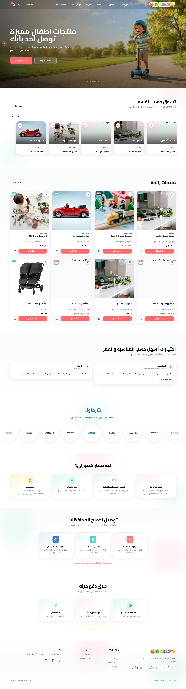
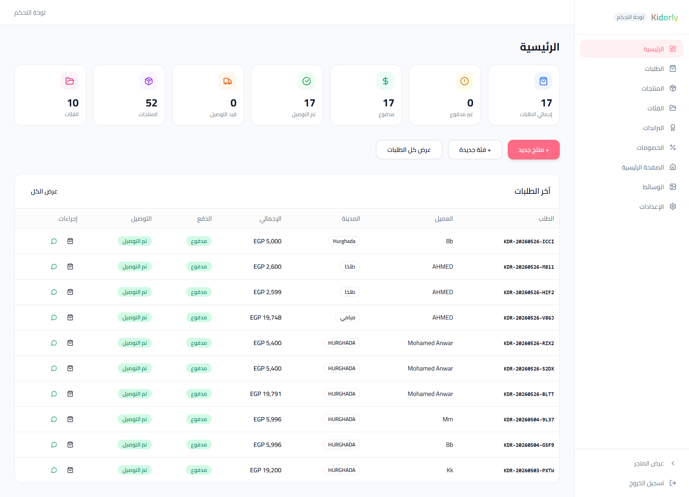

# Kidorly — Full-Stack Kids E-Commerce Platform

Kidorly is a full-stack multilingual e-commerce platform for kids products, built with **Next.js**, **TypeScript**, **Prisma**, **Neon/PostgreSQL**, and **Tailwind CSS**.

The platform includes a responsive public storefront and a complete admin dashboard for managing products, categories, brands, orders, discounts, media, homepage content, shipping settings, and store configuration.

## Live Demo

[View Website](https://kidorly.vercel.app/ar)

---

## Screenshots

> Add your project screenshots inside `docs/screenshots`.

```txt
docs/screenshots/home.png
docs/screenshots/admin-dashboard.png
docs/screenshots/products.png
docs/screenshots/orders.png
docs/screenshots/checkout.png
```

Example:

```md


```

---

## Overview

Kidorly is designed for selling kids products such as strollers, scooters, toys, hoverboards, and related items.

The storefront supports **Arabic**, **English**, and **German**, with RTL support for Arabic and a responsive shopping experience across desktop and mobile.

Customers can browse products, explore categories and brands, view featured products, place real website orders, or order directly through WhatsApp.

---

## Key Features

- Full-stack e-commerce application
- Multilingual storefront: Arabic, English, and German
- Arabic RTL support
- Responsive public storefront
- Product listing and product details
- Category and brand browsing
- Featured products section
- Product filtering by suitable age/category
- Real checkout flow
- Website order creation
- WhatsApp ordering support
- Cash on delivery support
- InstaPay / Vodafone Cash payment instructions
- Shipping settings
- Admin authentication
- Protected admin dashboard
- Product management
- Category management
- Brand management
- Order management
- Discount management
- Media management
- Homepage content management
- Store settings management
- SEO-ready structure

---

## Admin Dashboard

The admin dashboard allows store managers to control the main parts of the platform from one place.

Admin features include:

- Dashboard statistics
- Products management
- Categories management
- Brands management
- Orders management
- Discounts management
- Media management
- Homepage sections management
- Shipping settings
- Store settings

The dashboard also includes order statistics such as total orders, paid orders, unpaid orders, delivered orders, and delivery status.

---

## Tech Stack

- Next.js
- TypeScript
- Tailwind CSS
- Prisma
- Neon / PostgreSQL
- next-intl
- JWT-based admin authentication
- React Hook Form
- Zod
- Radix UI
- Lucide React

---

## Database

The project uses Prisma with PostgreSQL through Neon.

Main database models include:

- Product
- Category
- Brand
- Collection
- Tag
- AgeGroup
- Order
- OrderItem
- SiteSetting
- HomepageSection
- Media

---

## Payment Flow

Kidorly does not use online card payment integration.

Instead, it supports practical local payment options for the Egyptian market:

- Cash on delivery
- Vodafone Cash
- InstaPay
- Payment instructions displayed to the customer during checkout

---

## Ordering Flow

Customers can order in two ways:

1. Place an order directly through the website checkout.
2. Contact the store through WhatsApp for manual ordering or support.

This gives customers a flexible buying experience and helps the store handle both online and direct customer communication.

---

## Project Structure

```txt
KIDORLY
├─ prisma
│  ├─ schema.prisma
│  └─ seed.ts
├─ public
├─ src
│  ├─ app
│  │  ├─ api
│  │  └─ [locale]
│  ├─ components
│  ├─ lib
│  ├─ middleware.ts
│  └─ styles
├─ .env.example
├─ next.config.mjs
├─ package.json
├─ tailwind.config.ts
└─ tsconfig.json
```

---

## Getting Started

### 1. Clone the repository

```bash
git clone https://github.com/Karrim0/KIDORLY.git
cd KIDORLY
```

### 2. Install dependencies

```bash
npm install
```

### 3. Setup environment variables

Create a `.env` file based on `.env.example`.

```env
DATABASE_URL="your-postgresql-database-url"

ADMIN_EMAIL="admin@example.com"
ADMIN_PASSWORD="change-this-password"
JWT_SECRET="your-secure-jwt-secret"

NEXT_PUBLIC_APP_URL="http://localhost:3000"
NEXT_PUBLIC_DEFAULT_LOCALE="en"
```

### 4. Generate Prisma client

```bash
npm run db:generate
```

### 5. Push database schema

```bash
npm run db:push
```

### 6. Seed database

```bash
npm run db:seed
```

### 7. Run the development server

```bash
npm run dev
```

Open the project locally:

```txt
http://localhost:3000
```

---

## Available Scripts

```bash
npm run dev
npm run build
npm run start
npm run lint
npm run db:generate
npm run db:push
npm run db:migrate
npm run db:seed
npm run db:studio
```

---

## My Role

I built Kidorly as a full-stack e-commerce platform, including the public storefront, multilingual routing, admin dashboard, database structure, product and order management, checkout flow, shipping settings, and responsive UI implementation.

---

## Status

Production-ready demo with an active storefront and admin dashboard features.

---

## Author

Built by **Kareem Mohamed Hanafy**.

GitHub: [Karrim0](https://github.com/Karrim0)